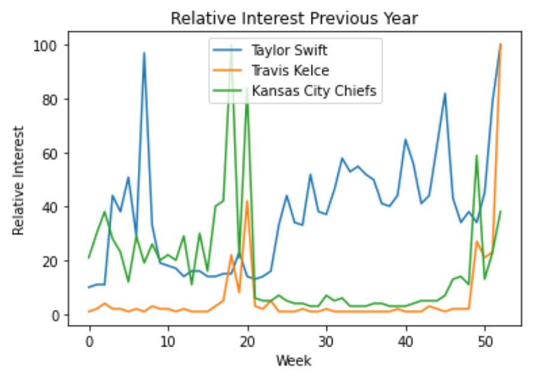
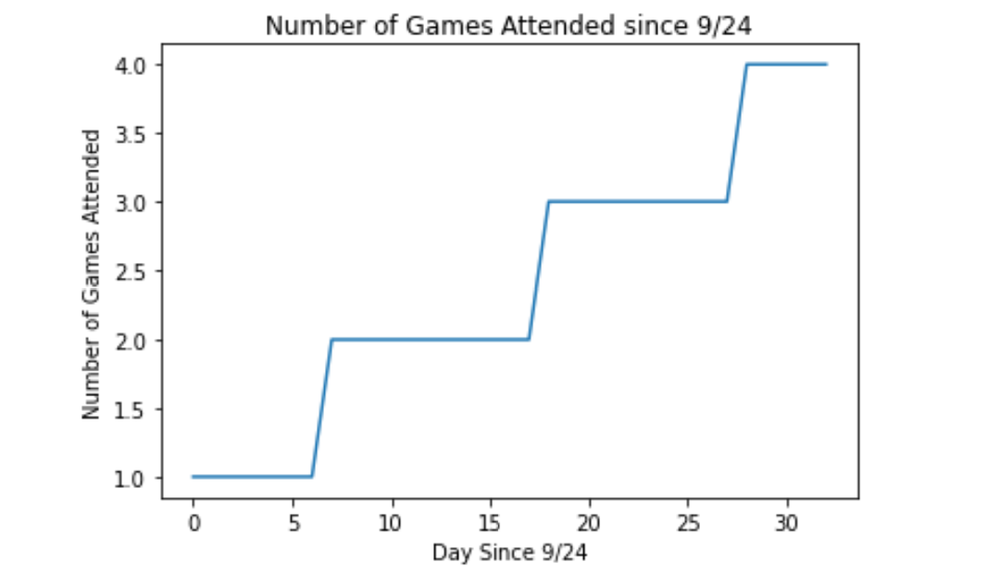

# Taylor Swift and Travis Kelce: Modern Romance or Crafty Marketing Campaign

## Background and Motivation
On September 24th, 2023 Taylor Swift was spotted at Arrowhead stadium in Kansas City, Missouri. This was the first evidence to support relationship rumors between Taylor Swift and Chiefs Tight-End Travis Kelce since they met during her summer Era’s tour and began spending more time together. What followed was an internet storm of speculation. Swifties were turning to the NFL in droves, hoping to catch glimpses of Taylor Swift attending games. Commentators for the Chiefs began using quotes from Taylor Swift songs to describe the games, and stats have even been published to compare the performance of Kelce when Swift is and is not in attendance. 

But is this purported romance all that it is meant to be, or simply a shroud for a more sinister plot? There is ample research in the field of economics on the influence of popular culture on consumer behavior. We are all influenced to spend our money in the way that others are spending their money, from the clothes we decide to wear to the music we listen to. Studies have shown that popular culture influences our perceptions on fair price, and that this effect is compounded by social media [1] [2].

In this project I am asking the guiding question: Is the partnership between Taylor Swift and Travis Kelce legitimate, or simply a ploy to increase relative interest in their respective brands and thereby increase influence on popular culture? If this were the case, both parties would effectively be molding popular culture to create economically favorable conditions for their brands. I aim to investigate this question in the following ways: 

Aim One: Investigate changes in relative interest for each entity before Swift appearance on 9/24

Aim Two: Use regression to predict relative interest for each entity 

This project is interesting to me because I was a fan of both Taylor Swift and the NFL (though admittedly not the Chiefs) prior to their intersection. I also think it is entertaining to question popular social narratives, and apply statistical reasoning to cultural phenomena. 

## Data
While I would have liked to analyze financial or economic data for this project, this was not publicly available. Instead I used data available from Google Trends to track relative interest scores for Taylor Swift, Travis Kelce, and the Kansas City Chiefs. 

Relative interest is a normalization metric that is performed by Google to assign scores to data based on the number of searches in a given time frame. I generated relative interest scores by week from the past year (9/24/22-9/24/23) to serve as a sample of relative interest from before the 9/24 game, and relative interest scores by day for days since 9/24 (9/24/2023-10/26/2023). These gave me two datasets with 53 data points in the before sample (Figure 1), and 33 data points in the after sample (Figure 2). 

#### Figure 1: Realative Interest for All Parties by Week- Past Year

   

#### Figure 2: Realative Interest for All Parties by Day - Since 9/24
  

  

I also wanted to examine a population that was likely to demonstrate interactions in the fanbases of Taylor Swift and Travis Kelce the most clearly. To do this, I generated relative interest scores by day for days since 9/24 (9/24/2023-10/26/2023) specifically localized to Kansas since this represents one of the states that considers the Kansas City Chiefs the home team (Figure 3). 

#### Figure 3: Realative Interest for All Parties by Day - Since 9/24 in Kansas
  

  

Finally, I gathered the dates of the games that Swift attended and categorized the dates post 9/24 according to the number of games Swift had attended (Figure 4). The intent was to use this data in regression modeling. The dates of the games attended were 9/24, 10/1, 10/12, and 10/22.

#### Figure 4: Number of Games Attended by Day Since 9/24
  

  

## Methods
To investigate hypothesis testing, a Wilcoxon Rank Sum test was performed. A null U-distribution for a 5 sample comparison of groups was constructed numerically (Figure 5).

#### Figure 5: Null U-Distribuion for 5 samples
  

  

The relative interest scores for the five weeks before 9/24 were compared to the relative interest scores in the five days after 9/24. A nonparametric test was used to complete hypothesis testing because the relative interest scores for the past year were plotted on a histogram and there was an apparent skew in the data for Travis Kelce and the Kansas City Figures (Figures 6 and 7). 

#### Figure 6: Histogram of Travis Kelce Relative Interest Scores
  

  

#### Figure 7: Histogram of Chiefs Relative Interest Scores
  

  

Since these distributions were constructed from greater than 30 observations and did not appear normal, t-testing from a t-distribution was not possible. A five sample U test was performed due to limitations in computing memory when attending to numerically construct larger null U-distributions. 

Regression analysis was performed to predict the relative interest post 9/24 for Travis Kelce and Taylor Swift. Complex regression models were constructed, regressing the popularity of the opposite figure in Kansas, the number of games Taylor Swift had attended, and the mixed effects of the two parameters. The complex regression models had the form: 
$Relative Interest = ax_1 + b_x2+ cx_1x_2 +d$

T-tests were used to analyze the significance of each of the fitted parameters for these terms using the Python Stats Model OLS package. Overall significance of the model was assessed using the generated F-statistic and null F-distribution comparison. P-values greater than 0.05 were considered statistically significant. 

## Results 
Hypothesis testing demonstrated no significant difference in any of the changes in relative interest before or after 9/24. The change in relative interest, the U test statistic and the p-value is reported for each party below.

Taylor Swift: +7.8, U = 9, p=0.274
Travis Kelce: +27.8, U = 5, = 0.075
Kansas City Chiefs: -3.4, U = 18, p=0.155

Since the Kansas City Chiefs experienced a decrease in relative interest, they were not included in regression analysis. 

Complex regression analysis generated significant models predicting Taylor Swift relative interest post 9/24 (Table 1), and Travis Kelce Relative interest post 9/24 (Table 2).

#### Table 1: Regression Analysis Output - Predicting Taylor Swift Relative Interest
  

  

##### Table 2: Regression Analysis Output - Predicting Travis Kelce Relative Interest
  

  

The only parameters found to be significant in the complex models were the relative interest of the opposite party. 

##Analysis 

##Conclusions and Future Directions 

##References
